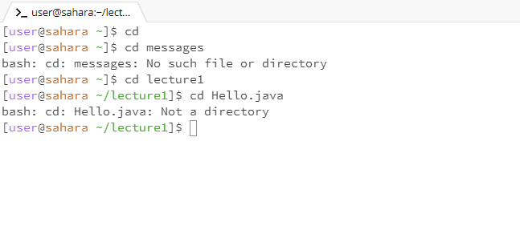
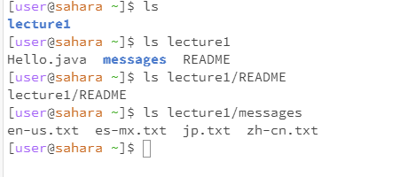
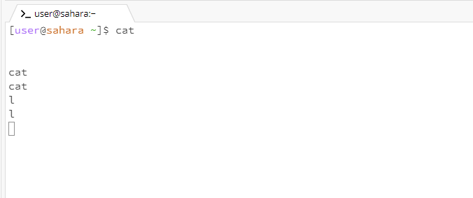
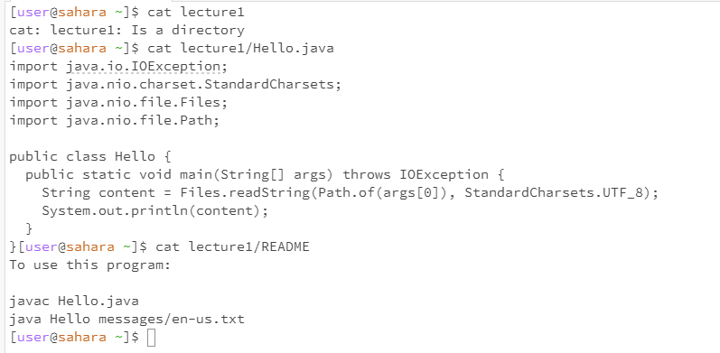

# Hello, world!

# cd

__1.If I don't make any arguments, the cd command will print nothing.(However, if you have cd to a new path, a separate cd will return to the /home path.)__

__2.If I give cd command a path to a directory, it will move the default path to that directory.__

__3.If you use cd to go to a file, it will say Not a directory__

# ls

__1.Because the default path is /home, ls by it self will display the name of the first and only directory which is lecture1.__

__2.When we give ls any correct directory path, it will print the name of the entire directory and the files in it. At the same time, you can notice that it marks the directory in blue.__

__3.When we give it a path to a file, it will display the path we gave it and will not display the class content in the file.__

# cat

__1.When we use a cat alone, it will enter an extraordinary state. It will not continue to pop up [user@sahara ~] to let us enter instructions but will continue to copy the content we enter until we give it an EOF signal.__

__2.When we give cat a directory path, it will report an error saying that the path given to it is directory.__

__3.And when the path we give it is a file, it will run normally and print the class content it can get in the file.__
